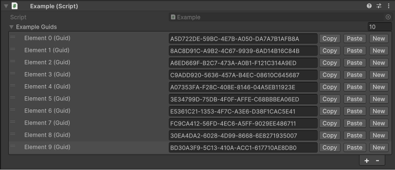

# SH.Serializables


This package is for the Unity engine that adds a serialization feature for the built-in *System.Guid* type. This makes it easier to add, copy and paste *Guid* values in Unity projects.

## Features

- **Ease of use:** *Guid* is serialized to a string, which makes it easy for a programmer to edit and read.
- **Validity Checker:** The package has a built-in string validation mechanism to make sure that the entered *Guid* values are correct.
- **Built-in editor:** For easier work with *Guid* values, the package implements a custom editor that provides a clear and intuitive way to display and enter *Guid* values in Unity.

## Editor view



## Usage

```csharp
public class Example : MonoBehaviour
{
    public List<SH.Serializables.SerializableGuid> exampleGuids = new();

    private void Awake()
    {
        foreach (var item in exampleGuids)
        {
            Debug.Log(item.Guid.ToString()); // System.Guid
        }
    }
}
```

## Installation

1. Open the package manager in the Unity engine.
2. Click on the add icon in the upper left corner of the manager and select *Add package from git URL...*.
3. Paste the following link: [https://github.com/SzymonHalucha/SH.Serializables.git](https://github.com/SzymonHalucha/SH.Serializables.git).
4. Click *Add* button.

## Versioning

We use [SemVer](http://semver.org/) for versioning. For the versions available, see the [branches on this repository](https://github.com/SzymonHalucha/SH.Serializables/branches).

## Authors

- **Szymon Hałucha** - Maintainer

See also the list of [contributors](https://github.com/SzymonHalucha/SH.Serializables/contributors) who participated in this project.

## License

This project is licensed under the MIT License - see the [LICENSE](./LICENSE) file for details.
